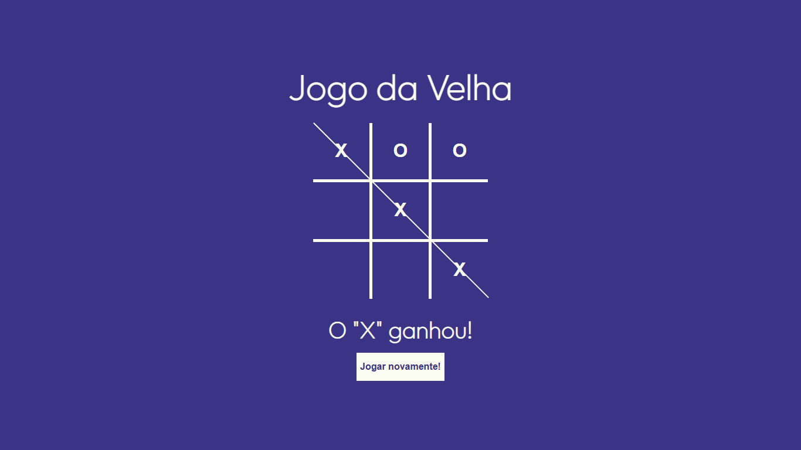

# Jogo Da Velha
Jogo da velha criado por mim, em JavaScript, com funcionalidades padrão, mas bem intuitivas.

  
# Jogo Da Velha

Jogo da velha criado por mim, em JavaScript, com funcionalidades padrão, mas bem intuitivas.

## 🔨 Funcionalidades do projeto

Jogo da velha criado por mim, em JavaScript, com funcionalidades padrão, mas bem intuitivas.

## ✔️ Técnicas e tecnologias utilizadas

- `Funcionalidade 1`: HTML. Linguagem de marcação..
- `Funcionalidade 2`: CSS. Linguagem para estilização do html.
- `Funcionalidade 3`: Javascript. Linguagem de programação.

## 📁 Acesso ao projeto

[Clique aqui para acessar](https://ericksilverio00.github.io/JogoDaVelha/)

## 🛠️ Abrir e rodar o projeto

Para abrir e rodar o projeto basta clicar nos ícones de navegação.
